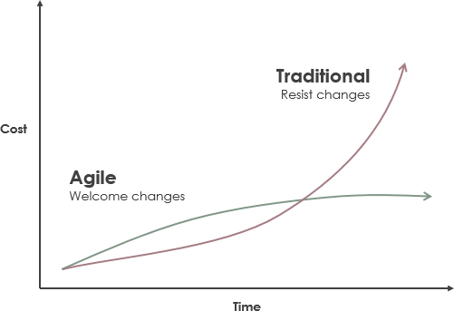

# 敏捷软件开发

will（毛广献）

运维开发工程师

---

---

Robert C. Martin 俗称 Uncle Bob ，《代码整洁之道》、《架构整洁之道》作者，敏捷宣言作者之一

---

中文版审校者熊节

《重构》《实现模式》《敏捷中国史话》

《敏捷：清理门户》<!-- .element: class="fragment" -->

---

谈到敏捷你最先想到什么？

- Scrum ？<!-- .element: class="fragment" -->
- 快 ？<!-- .element: class="fragment" -->

---

**目录**

- [敏捷简介](#/6)
- [业务实践](#/51)
- [团队实践](#/73)
- [技术实践](#/82)
- [总结](#/103)

---

## 敏捷简介

---

### 瀑布软件开发

Winston Walker Royce 1970 年发布的关于管理大规模软件开发项目想法的论文中的图

Note:

人们从他的论文中拿走了瀑布软件开发模式的概念，然后瀑布软件开发模式统治了接下来的 30 年

---

#### 瀑布软件开发流程

---

计划会议

Note:

我们确定了项目的截止日期。开会决定分析阶段所需时间、设计阶段所需时间、实现阶段所需时间

---

分析阶段

Note:

分析阶段是一个很轻松欢乐的阶段，我们上上网，与客户聊聊天，当计划的时间结束时，我们结束了分析，“神奇”的完成了分析阶段

---

设计阶段

Note:

设计阶段我们把项目分成多个模块，并设计接口。新的需求被添加进来，老的需求被移除或者修改，我们很想重新分析这些改变，但是由于时间紧迫，我们只能把这些改变 hack 进设计，当计划的时间结束，我们结束了设计，设计阶段也神奇的完成了

---

实现阶段

Note:

实现阶段有明确的标准，我们没有办法来假装我们已经完成了实现阶段的工作。需求仍然在持续改变。我们很想回去重新进行分析、重新设计这些改变，但是由于所剩时间不多，我们只能把这些改变一个接一个的 hack 进代码里

---

交付前两周

Note:

当回头把这些代码与设计对比时，发现代码与设计跟之前的设想已经相差甚远。在交付日期只有两周时，我们告诉利益相关人（可能是产品负责人、客户等），我们不能如期交付软件。他们会作何反应

---

**瀑布开发模式并不会摧毁每一个项目，但是它仍然是一种灾难性的软件项目开发方式**

瀑布软件开发模式不适用的根本原因在于需求一直在变化，我们不可能在开始就做好需求分析和架构设计

---

### 敏捷宣言

Notes:

2001 年 17 位软件专家组织会议，期望能改善软件开发的糟糕状况，他们在细节上没有达成一致，但是共同创建了敏捷宣言

---

- **个体和互动**高于流程和工具
- **工作的软件**高于详尽的文档
- **客户合作**高于合同谈判
- **响应变化**高于遵循计划

尽管右项有其价值，我们更重视左项的价值<!-- .element: class="fragment" -->

---

### 敏捷软件开发概览

---

把时间分隔成增量小段，称为迭代（iterations）或者冲刺（sprints），迭代通常为一周或者二周

---

**迭代 0**

- 产生需求列表，被称作用户故事
- 建立开发环境，跑通整个研发流程，从写代码到发布上线的整个流程
- 评估用户故事，制定初步计划，将故事分配给最初的几个迭代
- 开发人员和架构师用来根据暂定的故事清单来构想系统的初始设计

---

**与瀑布的区别**

计划用户故事和架构设计永远不会停止。每一个迭代的任何时间，都会有一些分析、设计与实现，在敏捷软件开发中，一直在分析和设计。迭代并不是一个小瀑布

---

**迭代 1**

评估本次迭代计划完成多少用户故事，然后团队开始工作，完成用户故事

迭代结束，统计用户故事点数，调整项目时间

Notes:

迭代结束时，我们完成了部分用户故事，这是我们对一次迭代中可以完成用户故事数的首次测量。
我们假定每一个迭代都相似，我们就可以调整项目计划，重新计算项目的完成日期。这可能会严重超过之前计划的截止时间。随着迭代的进行，团队完成的点数，可能会变化，我们的调整可能会持续进行，直到它非常的稳定

---

### 敏捷软件开发提供数据

---

管理者在做决策时需要的数据

---

**团队速率图**

团队速率图表示团队每个迭代完成的用户故事点数

---

**燃尽图**

燃尽图表示项目用户故事点数的变化情况

---

打破幻想

Notes:

让他们失去希望是敏捷软件开发的主要目标，我们采用敏捷的目的就是为了在希望杀死项目之前摧毁希望，因为希望会导致管理者看不到项目的真实进度。敏捷软件开发引导项目走向最好的可能结果，可能这并不是最想要的结果，但这就是最好的可能结果

---

### 项目管理铁十字原则

Note:

四个方面可以有不同的系数，我们应该把项目朝着足够好，足够快，足够低成本并且只完成必须功能的方向前进，而不是每个的系数都是 100%

敏捷软件开发可以帮助开发者和管理者执行这种实用项目管理

---

项目管理者需要决定项目应该多好，多快，多低成本和完成多少功能。通常管理者可以调整如下变量：

- 需求范围
- 改变时间
- 增加人员
- 降低质量

---

改变时间？

但有时因为商业原因，时间并不能更改<!-- .element: class="fragment" -->

---

增加人员？

<!-- .element: class="fragment" -->

Notes:

有数据表明增加人员的前几周并不能提高生产力，反而会降低生产力，后面生产力会逐渐增加。你只能寄希望于后面会补上前面丢失的生产力，并且增加人员，通常会增加预算

---

降低质量？

我们认为停止写测试、停止做代码评审、停止做重构，仅仅写生产代码，可以加快速度<!-- .element: class="fragment" -->

<!-- .element: class="fragment" -->

Notes:

但是事实并非如此，不做这些看似没用的事情，不仅不会加快速度，反而会降低速度。如果你想走的更快，你应该先走好每一步。如果你想减少项目时间，唯一的选项就是提高质量

---

改变范围？

有些需求可能并不需要在截止时间内完成

<!-- .element: class="fragment" -->

---

### 业务价值优先级

利益相关者按照业务价值优先级给需求排序，我们应该优先做高优先级需求

---

### 敏捷要点

- 迭代输出可衡量
- 项目进度可评估
- 根据业务价值排序实现需求
- 尽可能的提高代码质量
- 时间主要靠调整需求范围

Notes:

上面描述的只是敏捷软件开发的大概，但这是敏捷的要点。每一个迭代的输出都是可以衡量的，用于持续评估时间表，需求按业务价值的顺序来实现，质量保持尽量的高，时间表主要靠改变需求范围来调整，这就是敏捷

---

### 极限编程

Circle of Life

最符合敏捷软件开发要求的实践

Notes:

XP（Extreme Programming）中文被译为极限编程。它最符合敏捷软件开发的要求。Ron Jeffries 总结了 XP 的实践图，被称为 “Circle of Life”

---

外圈的环是面向业务的实践，本质上相当于 Scrum 。它提供了软件开发人员与业务人员的沟通框架

---

中间的环是面向开发团队的实践，这些实践提供了开发团队内部沟通和自我管理的原则和框架

---

内圈的环代表了技术实践，指导和限制程序员保证尽可能高的技术质量

---

- 敏捷简介
- [业务实践](#)
- 团队实践
- 技术实践

---

## 业务实践

---

### 用户故事

业务需求以用户故事的形式呈现

用户故事是从用户的角度描述系统特性的简短描述，不包含具体细节

---

优点:

- 用户故事强调口头沟通
- 人人都可以理解用户故事
- 用户故事从用户角度描述需求

---

**示例**

简历解析：作为一名 HR，我想通过上传简历文件，来结构化候选人数据，用于快速搜索评估等

Note:

通常，我们把故事写在索引卡上，不一定非要使用软件工具

---

**INVEST 原则**：

- I: Independent 独立
- N: Negotiable 可协商
- V: Valuable 有价值
- E: Estimable 可评估
- S: Small 足够小
- T: Testable 可测试

---

**用户故事评估方法**

- 方法 1：Flying Fingers
- 方法 2：Planning Poker

---

**用户故事评估会议**

- 尽量项目所有人都参加用户故事评估会议
- 故事点数是相对单位，不代表时间单位，仅代表复杂度

Notes:

开发、测试、项目管理或其他利益相关者一起开会来进行用户故事的评估。用户故事的评估的数字并不表示周、天、时等其他时间单位，它只是个相对数字，只是表示需要付出努力的单位，和实际时间没有关系，可能有的人需要一天，有的人需要两天

---

### 迭代

---

**迭代计划会议**

- 利益相关者给业务价值排序
- 确定速率，即本次迭代要完成的故事点数
- 选择这个迭代将要完成的用户故事

Notes:

迭代以迭代计划会议（Iteration Planning Meeting (IPM)）开始，所有的团队成员都需要参加这个 IPM 会议，包括利益相关者、程序员、测试、项目经理。利益相关者查看用户故事，并按业务价值给它们排序

利益相关者的主要工作是选出程序员和测试人员在这个迭代将要完成的用户故事，因此，他们需要知道程序员认为他们能完成多少，这个数字就是速率，由于这是第一个迭代，我们并不知道速率，所以我们随便猜一个数字，比如：30

---

**注意**

速率并不是承诺，甚至不是试着去完成 30 点，它只是个猜测

---

**中点检查**

在迭代的时间中点，我们只完成了 10 点，那利益相关者就需要从迭代中去除 10 点的用户故事

---

**迭代结束**

到迭代结束可能只完成了 18 点，但这并不表示这个迭代失败了，一个迭代的目的是为了给管理者产生数据

Notes:

现在我们一个迭代可以完成 18 点，在下一个迭代我们应该计划 18 点，在 IPM 会议上，利益相关者选择 18 点的用户故事，在这个迭代，中点检查时发现已经完成了 12 点，因此利益相关者又增加了 6 点用户故事，总计划 24 点，可能结果我们完成了 22 点，那么下一个迭代就设置为 22 点

---

### 小版本发布

- 小步快跑，才能跑的更快
- 把发布和部署分开，部署表示软件已经准备就绪，可以发布，发布只是业务方面的决定

---

### 验收测试

验收测试是一种规范，它也是一个测试，例如：当用户输入有效的用户名和密码，然后单击登录，系统将显示欢迎页面

核心思想是需求应该由业务方来指定

Notes:

验收测试是最少被理解、最少被使用、最混乱的敏捷实践。其基本思想非常简单：需求应该由业务来指定

---

**实践**

- 验收测试由业务分析人员和 QA 在迭代中点之前编写。开发人员把这些测试集成进持续集成
- 这些测试就是用户故事完成的定义，只有通过这些测试才表示用户故事完成
- 业务分析人员指定正常业务路径，QA 编写异常业务路径，开发者与业务分析人员和 QA 一起确保从技术角度来看这些测试是有意义的

Notes:

QA 不在是在最后阶段才进入保证质量，他们在每一个迭代的开始就介入开发团队来阻止错误和遗漏，最后他们来决定软件是否可以部署

运行测试的工作应该由程序员来做，只有运行测试通过才表示他们的用户故事完成了，程序员可以通过持续构建来自动化这一测试过程

---

**敏捷想打破业务和开发团队之间的鸿沟，让业务和开发能更好的合作**

---

- 敏捷简介
- 业务实践
- [团队实践](#)
- 技术实践

---

## 团队实践

---

### 隐喻

寻找可以形象比喻项目或者项目中模块组件的词语，然后团队使用这个词语交流。领域驱动设计（Domain-Driven Design）使用统一语言（Ubiquitous Language）方便团队交流

Notes:

Stage

---

### 可持续的速度

- 开发团队可持续的开发速度很重要
- 通过加班来提高开发速度不可持续，我们可能会在加班期间做错误的决定，写错误的代码，最后反而会起反效果
- 软件开发是一个马拉松过程，我们不能在早期就把体力用的过快，我们要维持可持续的速度

---

### 集体所有制

代码集体所有，任何人随时都可以查看获取修改代码

---

### 持续集成

- 尽早的进行代码集成，尽早的发现错误，修改错误
- 持续集成的极致是每次的代码提交都进行集成
- 当持续集成失败时，所有人都不能提交代码，直到持续集成被修复

---

- 敏捷简介
- 业务实践
- 团队实践
- [技术实践](#)

---

## 技术实践

没有技术实践的敏捷，只是一个没有效率的空壳

Notes:

许多程序员试图在没有这些技术实践的情况下实践敏捷。然而，他们失败了，因为这些实践是敏捷的核心。没有 TDD，没有重构，没有简单设计，甚至没有结对编程，敏捷就变成了一个没有效率的松散外壳

---

### 测试驱动开发（TDD）

先写测试代码，然后编写生产代码让测试通过，然后重构改善代码<!-- .element: class="fragment" -->

---

**TDD 三原则**

- 在编写失败的测试代码之前，不允许写任何生产代码<!-- .element: class="fragment" -->
- 在有测试失败的情况下不允许再写测试代码，编译失败也是失败的测试<!-- .element: class="fragment" -->
- 只编写足够的生产代码来让测试通过<!-- .element: class="fragment" -->

Notes:

没有经过大量练习 TDD 的程序员可能觉得这些原则有些怪异，甚至无法接受

---

**TDD 优点**

- 测试帮助理我们清思路，说明我们希望代码完成什么功能<!-- .element: class="fragment" -->
- 测试可能就是软件最好的文档<!-- .element: class="fragment" -->
- 代码的设计更好<!-- .element: class="fragment" -->
- 更利于重构<!-- .element: class="fragment" -->

Notes:

你写的测试可能就是软件最好的文档，测试里有软件或者库的多种使用方式

由于先编写测试，你需要让你的代码更容易测试，因为松耦合的代码更容易测试，所以你需要解耦代码，这样你的代码设计也会更好

由于测试比较完整，当你看到需要改善的代码时，你可以放心的修改它，因为有测试代码帮你验证，你的改动有没有影响到之前的功能

---

### 重构

在不改变软件外在行为的情况下，改善代码的内部设计

每个重构都可以划分成多个很小的步骤，可以随时停下，而不影响代码的正常运行

Note:

重构与 TDD 密切相关，为了不害怕重构代码，我们需要完整的测试来给我们非常高的信心，以保证我们的修改不会破坏之前的功能

---

**红绿重构**

- 首先，我们创建一个失败的测试<!-- .element: class="fragment" -->
- 然后，我们编写代码让测试通过<!-- .element: class="fragment" -->
- 然后， 我们重构让代码变的整洁<!-- .element: class="fragment" -->
- 回到开始的步骤<!-- .element: class="fragment" -->

---

### 简单设计

---

**Kent Beck 的简单设计原则**

- 通过所有测试：完成所有功能<!-- .element: class="fragment" -->
- 表明意图：之后要考虑重构让代码能表达程序员的意图，代码要易于阅读，自描述<!-- .element: class="fragment" -->
- 去除重复：之后要考虑重构去除重复代码，可能会使用到设计模式等<!-- .element: class="fragment" -->
- 减少元素：最后考虑减少代码元素，比如类、函数、变量等<!-- .element: class="fragment" -->

---

### 结对编程

两个人在同一个编程问题上工作，看和操作同一块代码

---

**结对编程优点**

- 结对编程是在团队成员之间共享知识和防止知识孤岛形成的最佳方式<!-- .element: class="fragment" -->
- 结对编程能减少了错误并提高设计质量<!-- .element: class="fragment" -->
- 结对编程是另一种形式的代码评审<!-- .element: class="fragment" -->

---

**注意 注意 注意**

管理者不要干涉结对编程，相信程序员。程序员也永远不要向管理者请求结对、测试和重构的时间，你是专家，你应该自己决定

---

**没有技术实践的敏捷都是伪敏捷，都注定要失败**

---

## 总结

---

**原则**

- 小步快跑
- 及时反馈

---

**目标**

- 通过在业务实践中使用用户故事，可以加强开发人员和业务人员的沟通，增加业务理解
- 通过在业务实践中使用迭代，可以让项目进度透明可衡量
- 通过在业务实践中使用小版本发布，可以更快的上线业务，更快的得到反馈，及时调整方向
- 通过在业务实践中使用验收测试，可以在代码中记录业务细节，验证需求是否被完整的实现
- 通过团队实践中使用持续集成，可以让软件处于随时可用并且可发布的状态
- 通过在技术实践中使用 TDD、重构、简单设计和结对编程，可以提高软件质量，保证后续的开发速率

---

## 谢谢
