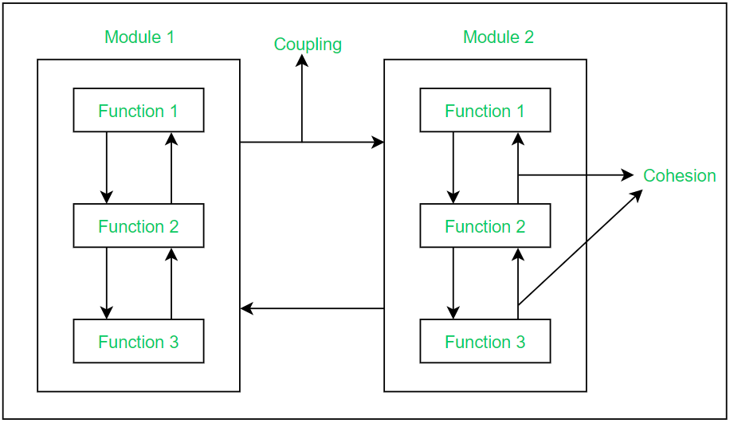

# 敏捷软件开发

---

will（毛广献）

运维开发工程师

https://mgxian.dev/

<iframe frameborder="0" width="80%" height="500px"  scrolling="no" src="https://mgxian.dev/"></iframe>

---

---

Robert C. Martin 俗称 Uncle Bob ，《代码整洁之道》、《架构整洁之道》作者，敏捷宣言作者之一

---

中文译者熊节

可能译名《敏捷：溯本清源》

《敏捷：清理门户》<!-- .element: class="fragment" -->

---

谈到敏捷你最先想到什么？

- Scrum ？<!-- .element: class="fragment" -->
- 快 ？<!-- .element: class="fragment" -->

---

**目录**

* [什么是敏捷](#/7)
* [为什么要采用敏捷](#/44)
* [业务实践](#/51)
* [团队实践](#/73)
* [技术实践](#/82)
* [实施敏捷](#/96)
* [总结](#/103)

---

## 什么是敏捷

---

### 瀑布软件开发

Winston Walker Royce 1970 年发布的关于管理大规模软件开发项目想法的论文中的图

---

人们从他的论文中拿走了瀑布软件开发模式的概念，然后瀑布软件开发模式统治了接下来的 30 年

瀑布软件开发模式不适用的根本原因在于需求一直在变化，我们不可能在开始就做好需求分析和架构设计

---

### 敏捷宣言

2001 年 17 位软件专家组织会议，期望能改善软件开发的糟糕状况，他们在细节上没有达成一致，但是共同创建了敏捷宣言

---

- 个体和互动高于流程和工具
- 工作的软件高于详尽的文档
- 客户合作高于合同谈判
- 响应变化高于遵循计划

尽管右项有其价值，但我们更重视左项的价值<!-- .element: class="fragment" -->

---

- Individuals and interactions over processes and tools
- Working software over comprehensive documentation
- Customer collaboration over contract negotiation
- Responding to change over following a plan

That is, while there is value in the items on the right, we value the items on the left more

---

### 敏捷软件开发概览

---

#### 项目管理铁十字原则

任何项目都只能从好、快、低成本、完成四个方面中选择三个

---

四个方面可以有不同的系数，我们应该把项目朝着足够好，足够快，足够低成本并且只完成必须功能的方向前进，而不是每个的系数都是 100%

敏捷软件开发可以帮助开发者和管理者执行这种实用项目管理

---

#### 敏捷软件开发提供数据，管理者在做决策时需要的数据

---

**团队速率图**

团队速率图表示团队每个迭代完成的用户故事点数

---

**燃尽图**

燃尽图表示项目用户故事点数的变化情况

---

#### 传统软件开发

---

我们确定了项目的截止日期。开会决定分析阶段所需时间、设计阶段所需时间、实现阶段所需时间

---

分析阶段是一个很轻松欢乐的阶段，我们上上网，与客户聊聊天，当计划的时间结束时，我们结束了分析，“神奇”的完成了分析阶段

---

设计阶段我们把项目分成多个模块，并设计接口。新的需求被添加进来，老的需求被移除或者修改，我们很想重新分析这些改变，但是由于时间紧迫，我们只能把这些改变 hack 进设计，当计划的时间结束，我们结束了设计，设计阶段也神奇的完成了

---

实现阶段有明确的标准，我们没有办法来假装我们已经完成了实现阶段的工作。需求仍然在持续改变。我们很想回去重新进行分析、重新设计这些改变，但是由于所剩时间不多，我们只能把这些改变一个接一个的 hack 进代码里

---

当回头把这些代码与设计对比时，发现代码与设计跟之前的设想已经相差甚远。在交付日期只有两周时，我们告诉利益相关人（可能是产品负责人、客户等），我们不能如期交付软件。他们会作何反应

---

**瀑布开发模式并不会摧毁每一个项目，但是它仍然是一种灾难性的软件项目开发方式**

---

#### 敏捷软件开发

---

我们把时间分隔正常的增量小段，称它为迭代（iterations）或者冲刺（sprints），右侧是截止时间。迭代通常为一周或者二周

---

**迭代 0**

* 产生需求列表，被称作用户故事
* 建立开发环境，评估用户故事，制定初步计划，将故事分配给最初的几个迭代
* 开发人员和架构师用来根据暂定的故事清单来构想系统的初始暂定设计，编写用户故事，评估用户故事

---
**与瀑布的区别**

计划用户故事和架构设计永远不会停止。每一个迭代的任何时间，都会有一些分析、设计与实现，在敏捷软件开发中，我们一直在分析和设计。迭代并不是一个小瀑布

---

**迭代 1**

迭代 1 从评估本次迭代计划完成多少用户故事开始，然后团队开始工作，完成用户故事。
迭代结束时，我们完成了部分用户故事，这是我们对一次迭代中可以完成用户故事数的首次测量。
我们假定每一个迭代都相似，我们就可以调整项目计划，重新计算项目的完成日期。这可能会严重超过之前计划的截止时间。随着迭代的进行，团队完成的点数，可能会变化，我们的调整可能会持续进行，直到它非常的稳定

---

让他们失去希望是敏捷软件开发的主要目标，我们采用敏捷的目的就是为了在希望杀死项目之前摧毁希望，因为希望会导致管理者看不到项目的真实进度。敏捷软件开发引导项目走向最好的可能结果，可能这并不是最想要的结果，但这就是最好的可能结果

---

#### 再看项目管理铁十字原则

项目管理者需要决定项目应该多好，多快，多低成本和完成多少功能。通常管理者可以调整范围、时间、人员和质量

---

改变时间？

但有时因为商业原因，时间并不能更改<!-- .element: class="fragment" -->

---

增加人员？

<!-- .element: class="fragment" -->

有数据表明增加人员的前几周并不能提高生产力，反而会降低生产力，后面生产力会逐渐增加。你只能寄希望于后面会补上前面丢失的生产力，并且增加人员，通常会增加预算
<!-- .element: class="fragment" -->

---

降低质量？

我们都本能的认为停止写测试、停止做代码评审、停止做重构，仅仅写生产代码，可以加快速度。但是事实并非如此，不做这些看似没用的事情，不仅不会加快速度，反而会降低速度。如果你想走的更快，你应该先走好每一步。如果你想减少项目时间，唯一的选项就是提高质量
<!-- .element: class="fragment" -->

---

改变范围？

有些需求可能并不需要在截止时间内完成
<!-- .element: class="fragment" -->

---

#### 业务价值优先级

我们会问利益相关者下一个我们应该实现的需求，这些需求是利益相关者已经按照业务价值优先级排序之后的需求，我们只做利益相关者要求我们做的需求

---

#### 敏捷要点

上面描述的只是敏捷软件开发的大概，但这是敏捷的要点。每一个迭代的输出都是可以衡量的，用于持续评估时间表，需求按业务价值的顺序来实现，质量保持尽量的高，时间表主要靠改变需求范围来调整，这就是敏捷

---

### Circle of Life

XP（Extreme Programming）中文被译为极限编程。它最符合敏捷软件开发的要求。Ron Jeffries 总结了 XP 的实践图，被称为 “Circle of Life” 

---

外圈的环是面向业务的实践，本质上相当于 Scrum 。它提供了软件开发人员与业务人员的沟通框架

---

中间的环是面向团队的实践，这些实践提供了开发团队内部沟通和自我管理的原则和框架

---

内圈的环代表了技术实践，指导和限制程序员保证尽可能高的技术质量

---

### 小结

敏捷就是用小的纪律帮助小团队管理小项目，大的项目不是由大团队完成的，而是由小团队分工合作完成的

---

## 为什么要采用敏捷

---

**专业主义**

软件已经遍布我们生活的方方面面，我们统治了世界，我们的软件错误可能会给其他人带来灾难，我们应该更专业

---

**合理的期望**

- 我们不制作质量不合格的软件
- 软件一直处于技术就绪状态，软件可随时发布
- 稳定的软件生产效率，开发软件的速率稳定
- 廉价的适应性，软件应该易修改
- 持续改进，软件应该是持续改进的
- 无所畏惧的能力，当我们修改代码时，我们需要有机制给我们足够的信心
- QA 应该找不到任何 BUG，当 QA 检查软件时，开发团队应该让 QA 找不出任何 BUG

---

- 测试应该自动化
- 开发人员之间的工作应该可以随时交换，保证每个人的工作都可以交由其他人来完成，防止突发情况
- 诚实的用户故事时间评估
- 在必要时说不，我们是专业的，应该在不合理的地方说不
- 持续积极的学习
- 指导别人，与别人一起相互指导学习

---

**客户权利法案**

- 你有权利制定一个全面的计划，知道什么时候可以完成什么事情，要付出什么代价
- 你有权从每个迭代中获得最大可能的价值
- 你有权查看正在运行的系统的进展，并通过可重复的测试来验证其有效性
- 你有权利改变你的想法，替换功能，改变优先级而不付出过高的成本
- 你有权获知日程安排和评估变更，及时选择如何缩小范围以满足截止日期。你可以随时取消项目，并留下一个有用的可工作的系统，反映投资到目前为止的软件

---

**开发者权利法案**

- 你有权利知道什么需求是需要的，并带有明确描述与优先级
- 你有权在任何时候都做出高质量的作品，业务不能强迫你降低质量
- 你有权向同事、经理和客户寻求帮助并接受他们的帮助
- 你有权作出和更新自己的评估，你可以在发现新因素时更改估算值，评估并不是承诺
- 你有权利接受你的责任，而不是被分配给你，你有权力拒绝

---

**小结**

敏捷是一个支持专业软件开发的纪律框架。敏捷不是一个流程，也不是时尚，也不仅仅是一些规则的集合。敏捷是一组权力、期望和纪律，它们构成了职业道德的基础

---

## 业务实践

---

### 计划

---

#### 项目时间评估

评估就是猜测，我们想在不实际开发这个软件的情况下，猜测项目会花费的时间，所以这肯定是不精确的，想更精确，你花费在评估上的时间就要更多

关于评估我们可以了解三变量评估和 PERT 评估方法

---

#### 用户故事

用户故事是从用户的角度描述系统特性的简短描述，例如：作为一名汽车司机，为了提高我的速度，我会更用力地踩油门踏板

通常，我们把故事写在索引卡上，不一定非要使用软件工具

---

#### ATM 用户故事示例

---

**用户故事**

- 取钱（Withdrawal）
- 存钱（Deposit）
- 转账（Transfer）
- 登录（Login）
- 登出（Logout）

在迭代 0，我们写出了以上的 5 个用户故事， 我们也讨论了这些用户故事的细节，比如用户使用密码登录等，但是我们不相信这些细节，我们没有把他们写在故事卡上，我们在故事卡上只写了上面简短的单词

---

**用户故事评估**

开发、测试、项目管理或其他利益相关者一起开会来进行用户故事的评估。用户故事的评估的数字并不表示周、天、时等其他时间单位，它只是个相对数字，只是表示需要付出努力的单位，和实际时间没有关系，可能有的人需要一天，有的人需要两天

---

**计划迭代 1**

迭代以迭代计划会议（Iteration Planning Meeting (IPM)）开始，所有的团队成员都需要参加这个 IPM 会议，包括利益相关者、程序员、测试、项目经理。利益相关者查看用户故事，并按业务价值给它们排序

---

利益相关者的主要工作是选出程序员和测试人员在这个迭代将要完成的用户故事，因此，他们需要知道程序员认为他们能完成多少，这个数字就是速率，由于这是第一个迭代，我们并不知道速率，所以我们随便猜一个数字，比如：30

速率并不是承诺，他们甚至不是试着去完成 30 点，它只是个猜测

---

**投资回报**

ROI （return on investment）和用户故事优先级评估

---

**中点检查**

在迭代的时间中点，我们只完成了 10 点，那利益相关者就需要从迭代中去除 10 点的用户故事

到迭代结束可能只完成了 18 点，但这并不表示这个迭代失败了，一个迭代的目的是为了给管理者产生数据

---

现在我们一个迭代可以完成 18 点，在下一个迭代我们应该计划 18 点，在 IPM 会议上，利益相关者选择 18 点的用户故事，在这个迭代，中点检查时发现已经完成了 12 点，因此利益相关者又增加了 6 点用户故事，总计划 24 点，可能结果我们完成了 22 点，那么下一个迭代就设置为 22 点

---

**项目结束**

随着迭代持续进行，速率被持续增加到速率图中，每个人都知道我们的项目开发速度

可能到了某个阶段，项目并没有实现所有的用户故事，但是项目却结束了，因为根据 ROI 原则，已经没有更多的用户故事值得去实现了，最早被写出来的用户故事的重要性可能早已消失不见了

---

#### 用户故事

用户故事应该遵循 INVEST 原则：

- I: Independent 独立
- N: Negotiable 可协商
- V: Valuable 有价值
- E: Estimable 可评估
- S: Small 足够小
- T: Testable 可测试

---

#### 用户故事评估

- 方法 1：Flying Fingers
- 方法 2：Planning Poker

根本原则是每个人的评估不能迫于别人给的压力而改变<!-- .element: class="fragment" -->

---

#### 管理迭代

每一个迭代的目的是通过完成用户故事来产生数据，团队应该着力于用户故事，而不是用户故事里的任务，完成了 80% 的用户故事，远好于把每个用户故事都完成了 80%。

---

### 小版本发布

小步快跑，才能跑的更快。把发布和部署分开，发布表示软件已经准备就绪，可以部署，部署只是业务方面的决定

---

### 验收测试

验收测试是最少被理解、最少被使用、最混乱的敏捷实践。其基本思想非常简单：需求应该由业务来指定

验收测试是一种规范，它也是一个测试，例如：当用户输入有效的用户名和密码，然后单击登录，系统将显示欢迎页面

---

**实践**

验收测试由业务分析人员和 QA 在迭代中点之前编写。开发人员把这些测试集成进持续构建。这些测试就是用户故事完成的定义，只有通过这些测试才表示用户故事完成

业务分析人员指定正常业务路径，QA 编写异常业务路径，开发者与业务分析人员和 QA 一起确保从技术角度来看这些测试是有意义的

---

QA 不在是在最后阶段才进入保证质量，他们在每一个迭代的开始就介入开发团队来阻止错误和遗漏，最后他们来决定软件是否可以部署

运行测试的工作应该由程序员来做，只有运行测试通过才表示他们的用户故事完成了，程序员可以通过持续构建来自动化这一测试过程

---

### 团队协作

- 团队所有成员应该坐在一起工作
- 保证团队可以随时面对面交流
- 远程办公也是可以的，只要能实时面对面沟通

---

### 小结

敏捷想打破业务和开发团队之间的鸿沟，让业务和开发能更好的合作，面向业务的实践在满足这个目标方面扮演了重要的角色。通过遵循这些实践，业务和开发有了一种简单而明确的沟通方式

---

## 团队实践

---

### 隐喻

寻找可以形象比喻项目或者项目中模块组件的词语，然后团队使用这个词语交流。领域驱动设计（Domain-Driven Design）使用统一语言（Ubiquitous Language）方便团队交流

---

### 可持续的速度

- 开发团队可持续的开发速度很重要
- 通过加班来提高开发速度不可持续，可能会在加班期间做错误的决定，写错误的代码，最后反而会起反效果
- 软件开发是一个马拉松过程，我们不能在早期就把体力用的过快，我们要维持可持续的速度
- 开发工作不是体力劳动，加班并不能说明你工作努力且专业
- 要保证有足够的睡眠
- 偶尔加班是可以的，但这不能是常态

---

### 集体所有制

代码集体所有，任何人随时都可以查看获取修改代码

---

### 持续集成

- 尽早的进行代码集成，尽早的发现错误，修改错误
- 持续集成的极致是每次的代码提交都进行集成
- 当持续集成失败时，所有人都不能提交代码，直到持续集成被修复
- 当持续集成失败时，可以发报警邮件，甚至可以设置报警灯和报警声音

---

### 每日站会

---

**指导原则**

- 会议是可选的
- 可以不用每天都开，有意义时才需要开
- 会议应该小 10 分钟，即使大团队

---

**发言规则**

- 上次会议到现在我做了什么
- 到下次会议之前我会做什么
- 我碰到了什么困难

会议上不允许讨论，不允许深入解释。每个人都可以发言，包括经理等，只要他们遵守规则。你也可以在会议上感谢给你帮助的其他人

---

### 小节

敏捷就是一组原则、实践和纪律，帮助小的团队构建小的软件项目，本章节的实践帮助小团队表现的像一个真正的团队。帮助团队构建他们的交流语言，以及团队成员如何对待彼此和他们正在构建的项目的期望

---

## 技术实践

---

许多程序员试图在没有这些技术实践的情况下实践敏捷。然而，他们失败了，因为这些实践是敏捷的核心。没有 TDD，没有重构，没有简单设计，甚至没有结对编程，敏捷就变成了一个没有效率的松散外壳

---

### 测试驱动开发（TDD）

先写测试代码，然后编写生产代码让测试通过，然后重构改善代码<!-- .element: class="fragment" -->

---

**TDD 三原则**

- 在编写失败的测试代码之前，不允许写任何生产代码
- 在有测试失败的情况下允许再写测试代码，编译失败也是失败的测试
- 只编写足够的生产代码来让测试通过

没有经过数月练习 TDD 的程序员可能觉得这些原则有些怪异，甚至无法接受

---

**TDD 优点**

- 如果你遵循了 TDD 原则，你写的测试可能就是软件最好的文档，测试里有软件或者库的多种使用方式<!-- .element: class="fragment" -->
- 由于先编写测试，你需要让你的代码更容易测试，因为松耦合的代码更容易测试，所以你需要解耦代码，这样你的代码设计也会更好<!-- .element: class="fragment" -->
- 由于测试比较完整，当你看到需要改善的代码时，你可以放心的修改它，因为有测试代码帮你验证，你的改动有没有影响到之前的功能<!-- .element: class="fragment" -->

---

### 重构

在不改变软件外在行为的情况下，改善代码的内部设计

重构与 TDD 密切相关，为了不害怕重构代码，我们需要完整的测试来给我们非常高的信心，以保证我们的修改不会破坏之前的功能

---

**红绿重构**

- 首先，我们创建一个失败的测试<!-- .element: class="fragment" -->
- 然后，我们编写代码让测试通过<!-- .element: class="fragment" -->
- 然后， 我们重构让代码变的整洁<!-- .element: class="fragment" -->
- 回到开始的步骤<!-- .element: class="fragment" -->

---

### 简单设计

---

**Kent Beck 的简单设计原则**

- 通过所有测试：完成所有功能<!-- .element: class="fragment" -->
- 表明意图：之后要考虑重构让代码能表达程序员的意图，代码要易于阅读，自描述<!-- .element: class="fragment" -->
- 去除重复：之后要考虑重构去除重复代码，可能会使用到设计模式等<!-- .element: class="fragment" -->
- 减少元素：最后考虑减少代码元素，比如类、函数、变量等<!-- .element: class="fragment" -->

---

### 结对编程

两个人在同一个编程问题上工作，他们可能分享屏幕、键盘和鼠标，他们看和操作同一块代码

---

**结对编程优点**

- 结对编程是在团队成员之间共享知识和防止知识孤岛形成的最佳方式
- 结对编程能减少了错误并提高设计质量
- 结对编程是另一种形式的代码评审

---

**生产力降低？**

结对编程可能会多花 15% 的编码时间，一个简单的计算表明，一个团队 50% 的时间是结对的，那么它的生产力就会降低 8% 以下。另一方面，如果结对的实践代替了代码评审，那么很可能根本不会降低生产力<!-- .element: class="fragment" -->

---
**注意事项**

管理者不要干涉结对编程，相信程序员。程序员也永远不要向管理者请求结对、测试和重构的时间，你是专家，你应该自己决定

---

### 小结

敏捷的技术实践是任何敏捷工作中最重要的组成部分。任何没有技术实践的敏捷实践尝试都注定要失败。原因很简单，敏捷是一种高效的机制，可以在很短的时间内把事情搞得一团糟。如果没有技术实践来保持高技术质量，团队的生产力将很快衰退并开始一个不可避免的死亡螺旋

---

## 实施敏捷

---

### 敏捷价值

---

**勇气**

部署最小的特性集需要勇气，维护高代码质量和高质量纪律也需要勇气。认为质量和纪律可以提高速度的信念是一种勇敢的信念，因为它将不断受到有权势但天真的人的挑战<!-- .element: class="fragment" -->

---

**沟通**

团队各成员可以更方便的面对面的、非正式的、人际间的对话。一个坐在一起并且交流频繁的团队可以创造奇迹<!-- .element: class="fragment" -->

---

**反馈**

敏捷原则实际上都是为那些需要做出重要决策的人提供快速的反馈。它们使我们能够尽早判断出什么时候出了问题，以便及时纠正。敏捷团队在反馈中茁壮成长。反馈是使团队高效工作的因素，也是推动项目取得有益成果的因素<!-- .element: class="fragment" -->

---

**简单**

简单性是指代码的直接性，以及沟通和行为的直接性。在代码中，一定数量的间接是必要的。间接是我们减少相互依赖复杂性的机制。在团队中，更少的间接是必要的。大多数时候，你想要尽可能的直接。保持代码简单，让团队更简单<!-- .element: class="fragment" -->

---

### 敏捷转型

- 建议充分采纳 Circle of Life，尤其是技术实践
- 敏捷转型在小的组织中更容易成功
- 敏捷培训师教导团队如何以敏捷的方式管理自己
- 敏捷教练不是培训师。他们是团队的成员，他们的角色是在团队中维护流程
- 敏捷认证完全是一个笑话，培训不应该专注于一个特定的角色，它应该适合团队中的每个人
- 从物理敏捷工具开始可能更安全、更明智，之后可以考虑引用软件工具

---

## 总结

作者认为是时候有人站出来告诉大家敏捷是什么了。敏捷应该是什么。是时候记住这些基础知识了。这些基础是 Circle of Life 。是极限编程的价值观、原则和纪律。是重构的动机、技术和纪律。这些基本原则是古老的、经过考验的、正确的，是敏捷软件开发的核心